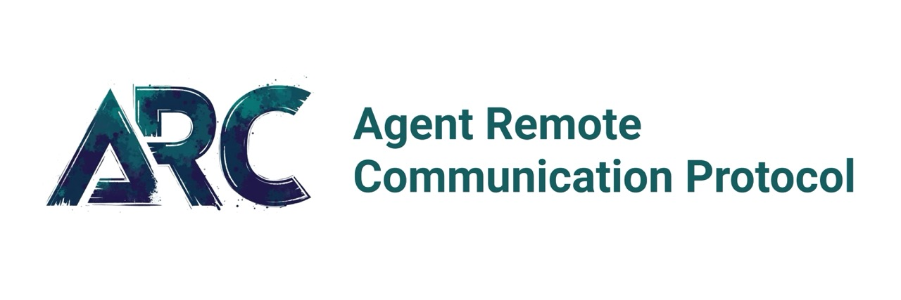

# ARC Ecosystem - Agent Communication Infrastructure

# 

[](https://opensource.org/licenses/Apache-2.0)
[](https://github.com/arcprotocol/arcprotocol)
[](https://discord.gg/XYmp22xX5m)
[](https://twitter.com/arcprotocol)

## The Agent Communication Stack

The ARC Ecosystem provides a complete infrastructure for agent-to-agent communication, discovery, and intelligent routing:

- **ARC Protocol** - The communication layer for agent interactions
- **ARC Ledger** - The discovery layer for agent capabilities
- **ARC Compass** - The intelligent routing layer for finding the right agents

## ARC Protocol

**ARC Protocol** is an RPC protocol that solves multi-agent deployment complexity with built-in agent routing, load balancing, and workflow tracing. Deploy hundreds of different agent types on a single endpoint with zero infrastructure overhead.

### Key Features

- **Single Endpoint, Multiple Agents**: Deploy 10s or 100s of agents behind `https://company.com/arc`
- **Built-in Agent Routing**: Automatic routing via `requestAgent` and `targetAgent` fields
- **Load Balancing Ready**: Route to `finance-agent-01`, `finance-agent-02`, `finance-agent-03` automatically
- **End-to-End Workflow Tracing**: Track complex workflows across multiple agent interactions with `traceId`
- **Enterprise-Grade Security**: OAuth2 scopes designed for agent-to-agent communication
- **Comprehensive Error Handling**: 500+ categorized error codes with detailed context

```python
# Create a new task
task = await client.task.create(
    target_agent="document-analyzer-01",
    initial_message={"role": "user", "parts": [{"type": "TextPart", "content": "Analyze quarterly report"}]}
)

# Check progress
status = await client.task.info(task_id=task.taskId)
```

## ARC Ledger

**ARC Ledger** is a centralized agent discovery registry that serves as the authoritative directory of all available agents, their capabilities, and connection information, enabling seamless agent-to-agent communication.

### Key Features

- **Standardized Agent Cards**: Enforces a consistent schema for agent capabilities and metadata
- **Powerful Search**: Find agents by capability, skill, provider, or other attributes
- **Versioning Support**: Track agent versions and updates
- **Authentication**: Secure agent registration and discovery
- **Scalable Architecture**: Designed to handle millions of agent registrations

```typescript
// Find agents with specific capabilities
const documentAgents = await ledger.findAgents({
  capabilities: {
    fileUpload: true
  },
  skills: ["Extract Text"],
  limit: 5
});
```

## ARC Compass

**ARC Compass** is an intelligent routing layer for agent ecosystems that directs queries to the most appropriate agents based on their capabilities, availability, and performance. It serves as the "search engine" for the agent web.

### Key Features

- **Intelligent Agent Selection**: Matches queries to the most appropriate agents
- **Real-time Search**: Provides fast, real-time agent search results
- **Agent Ranking**: Ranks agents by relevance to the specific query
- **Agent-to-Agent Facilitation**: Enables direct communication between agents after discovery
- **Continuous Learning**: Improves routing decisions based on feedback

```typescript
// Search for the best agents for a specific query
const searchResult = await compass.search({
  query: "Create a business plan for a sustainable fashion startup",
  maxResults: 3
});

// Connect directly with the top matched agent using ARC Protocol
const topAgent = searchResult.agents[0];
const arcClient = new ARCClient({
  endpoint: topAgent.url,
  requestAgent: "my-agent-id",
  targetAgent: topAgent.agentId
});
```

## How It All Works Together

The ARC Ecosystem provides a complete solution for agent communication and discovery:

1. **Agent Registration**: Agents register their capabilities with ARC Ledger
2. **Agent Discovery**: Agents find other agents through ARC Compass
3. **Agent Communication**: Agents communicate directly with each other using ARC Protocol

This creates a powerful network of interconnected agents that can collaborate on complex tasks:

```
User → Agent A → ARC Compass → ARC Ledger → Results → Agent A → Direct Communication with Matched Agents → User
```

## SDK Implementations

ARC Protocol is available in multiple languages:

- [**Python SDK**](https://github.com/arcprotocol/python-sdk) - `pip install arc-sdk`
- [**JavaScript SDK**](https://github.com/arcprotocol/js-sdk) - `npm install @arcprotocol/sdk`
- [**Go SDK**](https://github.com/arcprotocol/go-sdk) - `go get github.com/arcprotocol/go-sdk`

## Enterprise Use Cases

### Financial Services
- **Multi-agent credit analysis**: Document extraction → Financial analysis → Risk assessment → Report generation
- **Real-time trading assistants**: Market data streams → Analysis → Recommendations

### Healthcare
- **Patient data processing**: Medical records → Diagnosis assistance → Treatment recommendations
- **Medical imaging workflow**: Image processing → Analysis → Report generation

### Customer Support
- **Tiered support system**: Initial triage → Specialist routing → Resolution tracking
- **Multi-channel support**: Email, chat, voice unified through single protocol

## Comparison to Existing Protocols

| Feature | ARC | ACP (Agent Communication Protocol) | A2A (Agent-to-Agent) | JSON-RPC 2.0 | gRPC | REST |
|---------|-----|-----------------------------------|----------------------|---------------|------|------|
| **Agent Routing** | ✅ Built-in | ✅ REST-based | ✅ Built-in | ❌ Manual | ❌ Manual | ❌ Manual |
| **Workflow Tracing** | ✅ Native | ✅ Built-in | ✅ Task tracking | ❌ Custom | ⚠️ External | ❌ Custom |
| **Multi-Agent Ready** | ✅ First-class | ✅ First-class | ✅ First-class | ❌ DIY | ❌ DIY | ❌ DIY |
| **Load Balancing** | ✅ Protocol-level | ⚠️ Server-based | ✅ Agent Cards | ❌ External | ❌ External | ❌ External |
| **Learning Curve** | ✅ Simple | ✅ Simple | ✅ Moderate | ✅ Simple | ❌ Complex | ✅ Simple |
| **Governance** | Open | Linux Foundation | Google-led | Open | Google-led | Open |

## Project Repositories

- [**ARC Protocol**](https://github.com/arcprotocol/arcprotocol) - Agent communication protocol
- [**ARC Ledger**](https://github.com/arcprotocol/arcledger) - Agent discovery registry
- [**ARC Compass**](https://github.com/arcprotocol/arccompass) - Intelligent agent routing

## Contributing

We welcome contributions to all ARC Ecosystem projects! See our [Contributing Guidelines](.github/CONTRIBUTING.md) and [Code of Conduct](.github/CODE_OF_CONDUCT.md).

## License

All ARC Ecosystem projects are licensed under the [Apache License 2.0](LICENSE).

## Community

- [**Discord**](https://discord.gg/arcprotocol) - Join our community chat
- [**Twitter**](https://twitter.com/arcprotocol) - Follow for updates
- [**GitHub Discussions**](https://github.com/arcprotocol/arc-protocol/discussions) - Ask questions and share ideas

---

<p align="center">
  <a href="https://arc-protocol.org">Website</a> •
  <a href="https://docs.arc-protocol.org">Documentation</a> •
  <a href="https://github.com/arcprotocol/arc-protocol/discussions">Discussions</a> •
  <a href="https://discord.gg/arcprotocol">Discord</a>
</p>